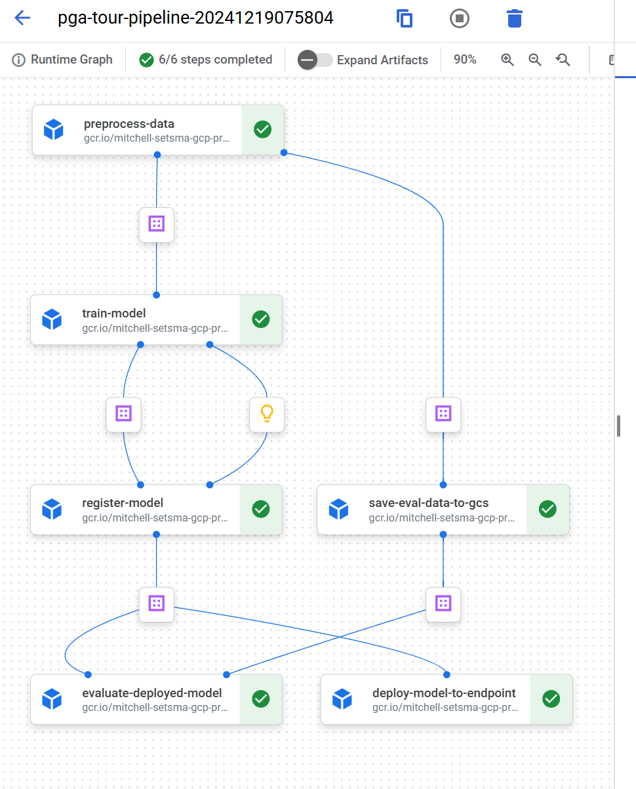

### High-Level
---
MLOps solution biased on PGA Tour data!

## Project Outline
---

### 1. Scope

- **Goal**: Predict future outcomes for PGA Tour players (e.g., finish position).
- **API**: Accept a player name (or ID) and return predictions for the next tournament.
- **Updates**: Models retrain weekly as new tournament data is published.

### 2. Data
- **Source**: Tabular PGA Tour data (2015–2022).
- **Structure**: Split data into training and testing and treat as a **time series problem**.
- **Database**:  BigQuery because of time series capabilities, ease of use, and integration to other services.

### 3. Model
- **Objective**: Predict finish position. Decided to use LSTM custom model.
- **Approach**: Pick the best model for time series data.
- **Evaluation**: Analyze results with metrics like RMSE or MAE.

### 4. Deployment
- **Platform**: GCP for scalability and throughput.
- **Method**: Real-time predictions via API for low-latency, on-demand use.
- **Compute**: Minimal resources needed (small model).

### 5. Monitoring & Maintenance
- **Logging**: Real-time inference logs to track performance, detect data drift, and monitor model versions.
- **Retraining**: Automate retraining with new tournament results.
- **Rollback**: Monitor performance and roll back models if necessary.
- **Monitoring**: Automate the splitting of new data and then use it for eval.

### 6. Security
- **Requirements**: Minimal security concerns (publicly available data).

## Vertex AI Pipeline Overview

## For more information please refrence...
---
Check out [Architecture](docs/ARCHITECTURE.md) for more information.

## Google Cloud Platform & GitHub
---
**Why GCP?** At the time of writing this, my current employer uses GCP for our cloud needs. If I had more time it would be fun to branch out and learn a new platform.

## Important Golf Terminology
---
- **Par**: The number of strokes a skilled player is expected to take to complete a hole.
- **Strokes**: The total number of shots a player takes on a hole, round, or tournament.
- **Cut**: A point at which the top players advance to the weekend and the rest are eliminated.
- **Strokes Gained**: a golf statistic that measures a player's performance by comparing each shot to a benchmark. 
- **Finish Position**:  A player's final placement in a tournament (e.g., 1st, 2nd, T32). 
- **Purse**: Total prize money awarded at the tournament.